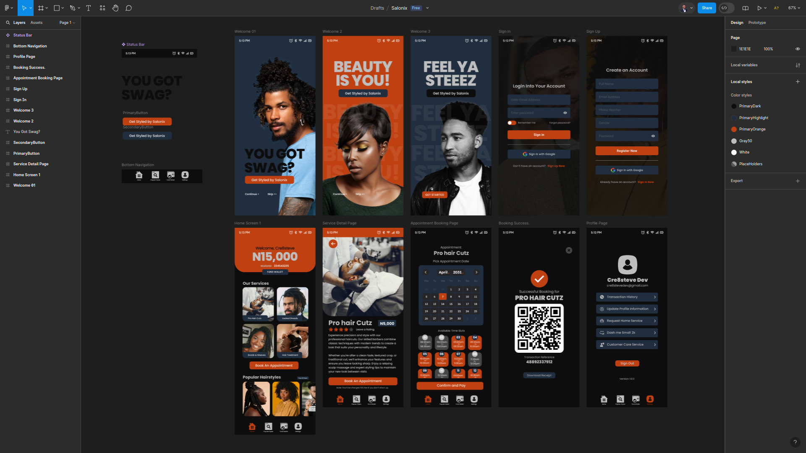

# Salonix - Mobile App

I am building Solanix as a full-feature personal challenge project to improve my skills and knowledge as a MERN Stack Developer transitioning from the Web to building Cross-platform Native applications.

I'm equally using these Mobile App projects to solidify my skills in Design (coming from print and marketing design, venturing into UI/UX Design has been exciting and I'm enjoying it - this is a custom design, as seen below. Might update it more - or not, hehe).

## AUTHOR

- Stephen Omoregie
- <cre8stevedev@gmail.com>
- Twitter: @Cre8steveDev

## Technology

- React Native (Expo Framework)
- EAS Build (Expo Go)

## Productivity Tools

- React Native and Expo Code Snippets (By Cre8steve)
- Visual Studio Code
- Claude AI for debugging and documentation research

## How to Set Up Locally

- Clone to your machine: `git Clone`
- Change directory: `cd salonix-mobile-app`
- Install dependencies: `npm install`

## Errrrm..... more details coming, i guess
